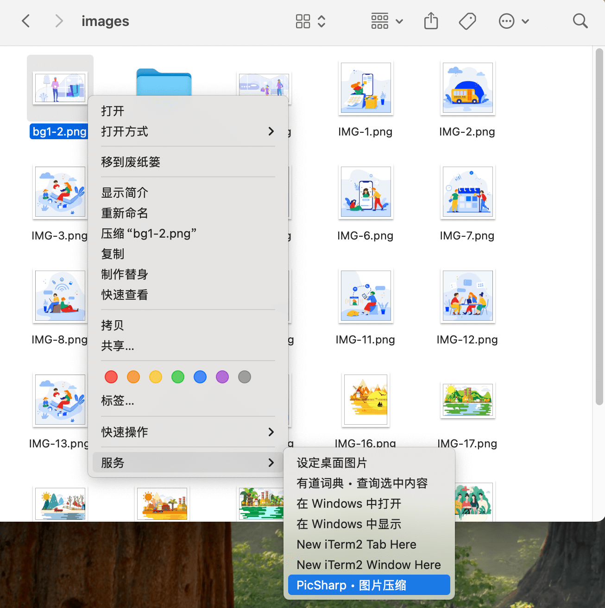

<div align="center">
  <a href="" target="_blank">
    
  </a>
  <h1>PicSharp</h1>
  <br>
</div>

A simple, efficient, and flexible cross-platform desktop image compression application.

## Supported Platforms

- **Mac:** ✅ (macOS 12+)
- **Windows:** ✅ (Windows 10+ x64)
- **Linux:** ✅ (Ubuntu 20.04+ or other Linux distributions that support `libstdc++` 11.3+)

## Key Features

### Compress Localy & TinyPNG


### Powerful Batch Processing


### Watch Mode


### Rich Configuration

| **General**                | **Description**               | **Status** |
| -------------------------- | ----------------------------- | ---------- |
| **Internationalization**   | Partial support: zh-CN, en-US | ✅         |
| **Dark/Light Theme**       | -                             | ✅         |
| **System Notifications**   | -                             | ✅         |
| **Startup on Boot**        | -                             | ✅         |
| **Auto Check for Updates** | -                             | ✅         |

---

| **Compression**            | **Description**                                                                                                                                      | **Status** |
| -------------------------- | ---------------------------------------------------------------------------------------------------------------------------------------------------- | ---------- |
| **Compression Mode**       | Default use Tinypng, if Tinypng compression fails, switch to local compression for retry.                                                            | ✅         |
| **Compression Type**       | Optional lossless compression and lossy compression are available. When the image does not support lossless compression, switch to lossy compression | ✅         |
| **Compression Level**      | Five levels can be selected. When using lossy compression, setting a reasonable compression level can achieve the best visual effect.                | ✅         |
| **Save Type**              | How to save compressed images after compression.                                                                                                     | ✅         |
| **Compression Rate Limit** | When the image compression rate is below the set threshold, saving will not be performed.                                                            | ✅         |

---

| **TinyPNG**             | **Description**                                                                                            | **Status** |
| ----------------------- | ---------------------------------------------------------------------------------------------------------- | ---------- |
| **API Keys Management** | Manage multiple TinyPNG API keys and provide functions such as availability detection and usage monitoring | ✅         |
| **Preserve Metadata**   | Select the metadata to preserve during compression.                                                        | ✅         |

### Easy to use

| **Feature**              | **Description**                                             | **Status**                                                                               |
| ------------------------ | ----------------------------------------------------------- | ---------------------------------------------------------------------------------------- |
| **Finder Services menu** | Use Finder Services menu to compress images **(Mac Only)**. |   |
| **DeepLink**             | Use DeepLink to compress images.                            | ✅                                                                                       |

## Summary

- **Powerful Batch Processing:** Based on Rust implementation, it scans selected files or directories with high performance and low resource consumption, identifying and processing image files within them. Even 100,000+ images can be handled with ease.
- **TinyPNG Integration:** Optional TinyPNG compression is available, with account pool management for automatic selection during task processing. Supported image formats: PNG/Animated PNG, JPEG, WebP, AVIF.
- **Offline Compression Support:** Fully localized processing with rich compression option configurations (compression level, lossy/lossless, etc.). Supported image formats: PNG, JPEG, WebP/Animated WebP, AVIF, TIFF, GIF, SVG.
- **Combined Compression Strategies:** TinyPNG offers the best compression ratio but requires an internet connection, is less efficient for large numbers of images, and is not suitable for sensitive images. Offline compression is slightly less effective than TinyPNG but offers extremely high batch processing efficiency, requires no internet connection, and ensures privacy and security. During compression, both strategies are automatically combined to achieve optimal processing efficiency.
- **Automatic Compression Mode:** Select folders to monitor, and images added to these folders will be automatically compressed, enhancing your workflow.
- **Convenient Operations:** Drag and drop files into the application or onto the application icon for quick opening, select files or directories in Mac Finder and choose a compression method from the "Services" menu, and more.
- **Rich Application Configuration:** Offers dark/light themes, multiple languages, system notifications, startup on boot, save methods for processed images, save locations, number of parallel tasks, and more.
- **Open Integration:** Provides image compression invocation capabilities via DeepLink, allowing automation tools to call it and enhance your workflow.

## Troubleshooting

### 1. PicSharp Won’t Launch on Windows (Missing Edge WebView2 Runtime)

**Symptom**

- When you double-click picsharp.exe, nothing happens. No window appears, and Task Manager does not show the process.
- This can affect both the standard installer and the portable version.

**Cause**

- Microsoft Edge WebView2 Runtime is either missing, outdated, or improperly installed on your system. PicSharp depends on WebView2 to render the interface on Windows.

**How to Fix**

1. Check if WebView2 is installed
   - Open “Add or Remove Programs” (a.k.a. Apps & features) on Windows. Look for “Microsoft Edge WebView2 Runtime.”
2. Install or Update WebView2
   - Download the WebView2 Runtime directly from Microsoft: [link](https://developer.microsoft.com/en-us/microsoft-edge/webview2?form=MA13LH).
   - If you prefer an offline installer, download the offline package and run it as an Administrator.
3. Re-run PicSharp
   - After installing/updating WebView2, launch picsharp.exe again.
   - If you still encounter problems, reboot your PC and try again.

**Additional Tips**

- If reinstalling once doesn’t work, uninstall Edge WebView2 completely, then reinstall it with Administrator privileges.
- Verify your Windows installation has the latest updates from Microsoft.

### 2. How to use AppImage in a Linux distribution

AppImage is a distribution format that does not rely on the system installed packages and instead bundles all dependencies and files needed by the application. For this reason, the output file is larger but easier to distribute since it is supported on many Linux distributions and can be executed without installation.

**1. Download**

Go to the [download page](https://github.com/AkiraBit/PicSharp/releases) to download the AppImage file corresponding to the system architecture.

**2. Set Permissions**

Open the directory where AppImage is located in the command line and set the running permissions for it.

```bash
chmod a+x PicSharp_x.x.x_xxx.AppImage
```

**3. Run**

```bash
./PicSharp_x.x.x_xxx.AppImage
```

## Development

To get started with PicSharp, follow these steps to clone and build the project.

```bash
git clone https://github.com/AkiraBit/PicSharp.git
cd PicSharp
```

**Requirements**

- Node.js 20+
- pnpm 9+
- Rust and Cargo for Tauri development

Refer to the [Tauri documentation](https://v2.tauri.app/start/prerequisites/) for details on setting up the development environment prerequisites on different platforms.

**1. Install Dependencies**

```bash
pnpm install
```

**2. Build for Development**

```bash
# For App
pnpm dev:app

# For Sidecar
pnpm dev:sidecar
```

**3. Build for Production**

About building on different platforms can distribute product details, please refer to the [Tauri document](https://v2.tauri.app/distribute/).

## Contributing

If you want to help out please see [CONTRIBUTING.md](CONTRIBUTING.md) to see how to get started.

## Roadmap

- [ ] Add Windows arm64 support

## Support

If you enjoy this project consider giving it a star ⭐.
