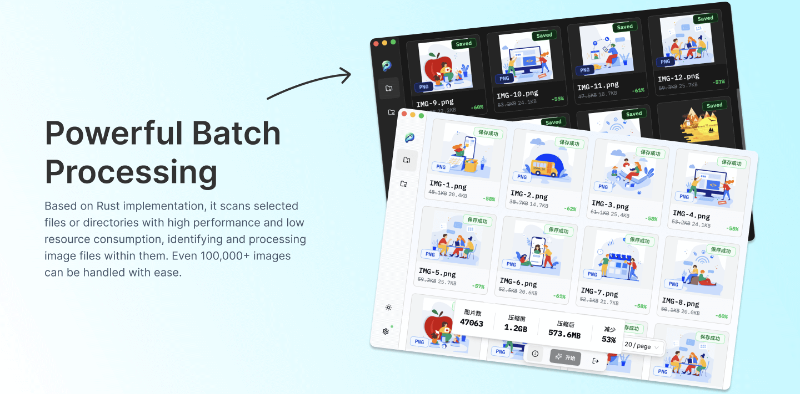
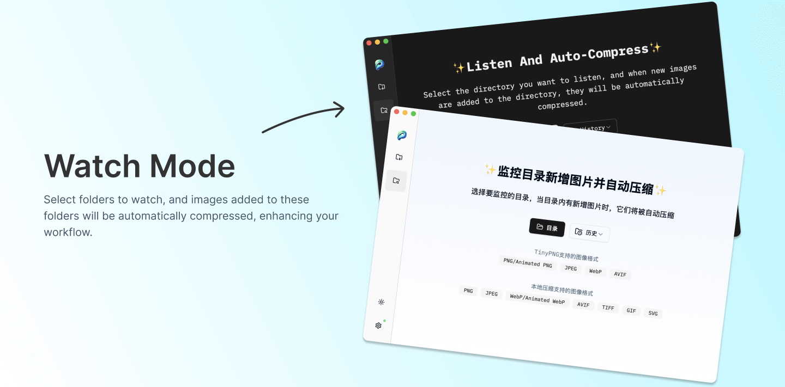

  
  <h1>PicSharp</h1>
   

A simple, efficient, and flexible cross-platform desktop image compression application.

## Supported Platforms

- **Mac:** Available
- **Windows:** Coming soon
- **Linux:** Coming soon

## Key Features

### Compress Localy & TinyPNG

### Powerful Batch Processing

### Watch Mode

### Rich Configuration

| **General**                | **Description**               | **Status** |
| -------------------------- | ----------------------------- | ---------- |
| **Internationalization**   | Partial support: zh-CN, en-US | ✅         |
| **Dark/Light Theme**       | -                             | ✅         |
| **System Notifications**   | -                             | ✅         |
| **Startup on Boot**        | -                             | ✅         |
| **Auto Check for Updates** | -                             | ✅         |

---

| **Compression**            | **Description**                                                                                                                                      | **Status** |
| -------------------------- | ---------------------------------------------------------------------------------------------------------------------------------------------------- | ---------- |
| **Compression Mode**       | Default use Tinypng, if Tinypng compression fails, switch to local compression for retry.                                                            | ✅         |
| **Compression Type**       | Optional lossless compression and lossy compression are available. When the image does not support lossless compression, switch to lossy compression | ✅         |
| **Compression Level**      | Five levels can be selected. When using lossy compression, setting a reasonable compression level can achieve the best visual effect.                | ✅         |
| **Save Type**              | How to save compressed images after compression.                                                                                                     | ✅         |
| **Compression Rate Limit** | When the image compression rate is below the set threshold, saving will not be performed.                                                            | ✅         |

---

| **TinyPNG**             | **Description**                                                                                            | **Status** |
| ----------------------- | ---------------------------------------------------------------------------------------------------------- | ---------- |
| **API Keys Management** | Manage multiple TinyPNG API keys and provide functions such as availability detection and usage monitoring | ✅         |
| **Preserve Metadata**   | Select the metadata to preserve during compression.                                                        | ✅         |

### Easy to use

| **Feature**             | **Description**                              | **Status** |
| ----------------------- | -------------------------------------------- | ---------- |
| **FinderServices menu** | Use Finder Services menu to compress images. | ✅         |
| **DeepLink**            | Use DeepLink to compress images.             | ✅         |

## Summary

- **Powerful Batch Processing:** Based on Rust implementation, it scans selected files or directories with high performance and low resource consumption, identifying and processing image files within them. Even 100,000+ images can be handled with ease.
- **TinyPNG Integration:** Optional TinyPNG compression is available, with account pool management for automatic selection during task processing. Supported image formats: PNG/Animated PNG, JPEG, WebP, AVIF.
- **Offline Compression Support:** Fully localized processing with rich compression option configurations (compression level, lossy/lossless, etc.). Supported image formats: PNG, JPEG, WebP/Animated WebP, AVIF, TIFF, GIF, SVG.
- **Combined Compression Strategies:** TinyPNG offers the best compression ratio but requires an internet connection, is less efficient for large numbers of images, and is not suitable for sensitive images. Offline compression is slightly less effective than TinyPNG but offers extremely high batch processing efficiency, requires no internet connection, and ensures privacy and security. During compression, both strategies are automatically combined to achieve optimal processing efficiency.
- **Automatic Compression Mode:** Select folders to monitor, and images added to these folders will be automatically compressed, enhancing your workflow.
- **Convenient Operations:** Drag and drop files into the application or onto the application icon for quick opening, select files or directories in Mac Finder and choose a compression method from the "Services" menu, and more.
- **Rich Application Configuration:** Offers dark/light themes, multiple languages, system notifications, startup on boot, save methods for processed images, save locations, number of parallel tasks, and more.
- **Open Integration:** Provides image compression invocation capabilities via DeepLink, allowing automation tools to call it and enhance your workflow.

## Roadmap

- [ ] Add Windows support
- [ ] Add Linux support

## Contributing

If you want to help out please see [CONTRIBUTING.md](CONTRIBUTING.md) to see how to get started.

## Support

If you enjoy this project consider giving it a star ⭐.
